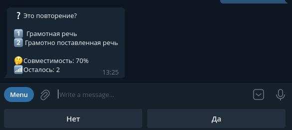
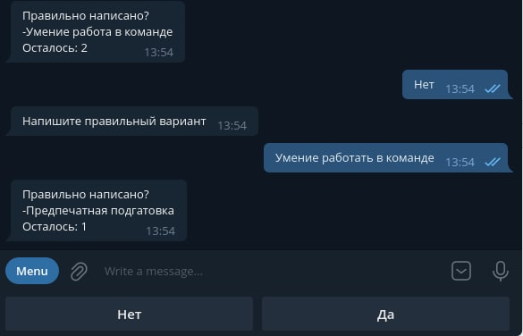

# ED_Telegram 
<i>v.1.0<i>

## Description
Данный репозиторий предназначен для хранения телеграм-ботов
с помощью которых стажеры-разработчики будут обучать наш алгоритм
по автоматическому выявлению дубликатов в списке навыков

На текущий момент в репозитории представлено два бота:
- Один для подтверждения корректности подобранной пары похожих навыков
- Второй для исправления грамматических ошибок, если они есть

[//]: # (ADd Image)


## Установка
Инструкция пока не готова <br>
Для первого бота нужно установить переменные окружения
- <b>DUPLICATE_REMOVER_TOKEN</b> - Токен бота
- <b>EDWICA_DB_HOST</b> - Хост БД без порта
- <b>EDWICA_DB_USER</b> - Пользователь БД
- <b>EDWICA_DB_PASS</b> - Пароль пользователя 


## Описание работы 
### 1. DuplicateRemoverBot

Первым делом стажер должен поработать с этим ботом, чтобы указать ему
на одинаковые навыки, от которых следует избавиться в нашей итоговой БД.
Благодаря этому, мы уменьшим количество проверок для второго бота, так
как ему придется работать с укороченной базой.

### Algorithm DuplicateRemoverBot
1. Подготовить для работы бота стартовый набор данных
- xlsx-таблица, в которой будет полный список "грязных" навыков

| id  | name                 |
|-----|----------------------|
| 1   | Усидчивость          |
| 2   | Python3              |
| ... | ...........          |
| n   | Ведение документации |

<!-- - SQL-таблица, содержащая список потенциальных дубликатов вида

| id  | original        | duplicate                | percent |
|-----|-----------------|--------------------------|-----|
| 32  | грамотная речь  | грамотная устная и письменная речь | 100 |
| 45  | ориентация на результат | нацеленность на результат| 79  |
| 371 | пользователь пк | отличное знание пк       | 99  |

<b>original</b> - наименование навыка, с которым сравнивается второй навык. Если
второй навык действительно окажется дубликатом,
то дубликат будет удален, а оригинал оставлен в БД <br/>
<b>id</b> - номер duplicate, благодаря этому значению 
мы можем точно удалить нужный навык <br/>
<b>percent</b> - процент схожести двух навыков
2. Создание config-файла с помощью ручного вызова метода  
````python
server.create_config_file(path="path to SQL table with duplicates")
  ```` -->
3. Запуск бота

### Принцип работы бота


В данном боте используется машина состояний, 
которая позволяет в правильной последовательности задавать
вопросы пользователю и запоминать ответы на эти вопросы.

Доступные состояния:
- Question - данное состояние активируется после команды ``/start`` и 
используется для отображения вопросов пользователю
- Last - состояние обработки последнего вопроса перед отключением бота. 
Активируется тогда, когда закончились вопросы в переданной SQL-таблице

### Завершение работы
По завершению работы бот очищает первоначальный "грязный" список навыков,
чтобы затем передать его второму боту, который будет проверять
уже укороченный список на грамматические ошибки

### 2. GrammarCheck

Второй этап обучения программы по автоматическому выявлению 
неподходящих навыков, будет исправлять грамматические ошибки, чтобы
в дальнейшем программа самостоятельно могла их исправлять

### Algorithm GrammarCheck
1. Подготовить для работы бота стартовый набор данных
- Путь до файла типа json (позже будет исправлено на тип .sql) вида

| id  | name  | new_name  |
|-----|-------|----------|
| 1   | Статистический онализ ||
| 2   | Предпечатная подгатовка ||
| ..  | ..... | .... |
| n-1 | Умение  работа в команде | |
| n   | Оформление документацие | |

Столбец ``new_name`` изначально будет пустым

2. Запуск бота
### Принцип работы бота

Машина состояний в этом боте имеет на одно состояние больше,
чем у предыдущего бота
- Question - аналогичный принцип работы, описанный выше
- Last - аналогичный принцип работы, описанный выше
- Rename - состояние, которое активируется тогда, когда используется ручное исправление наименования навыка 

### Завершение работы
По итогу мы получаем новую SQL-таблицу(позже, когда мы перейдем с json на sql,
мы будем не создавать, а редактировать существующую БД), в которой будет структура, подобной этой

| id  | name                                              | new_name                                              |
|-----|---------------------------------------------------|-------------------------------------------------------|
| 1   | Статистический <u style='color:red'>о</u>нализ    | Статистический <u style='color:green'>а</u>нализ      |
| 2   | Дисциплинированность                              |     |
| 3   | Предпечатная подг<u style='color:red'>а</u>товка  | Предпечатная подг<u style='color:green'>о</u>товка    |
| ..  | .....                                             | .....                                                 |
| n-1 | Умение  <u style='color:red'>работа</u> в команде | Умение  <u style='color:green'>работать</u> в команде |
| n   | Оформление документаци<u style='color:red'>е</u>  | Оформление документаци<u style='color:green'>и</u>    |

Если поле ``new_name`` пустое, мы будем считать, что ошибок
в написании навыка не было, поэтому будем использовать в качестве 
верного написания значение из ``name``.<br/> 
В противном случае, ``new_name``
будет рабочим вариантом